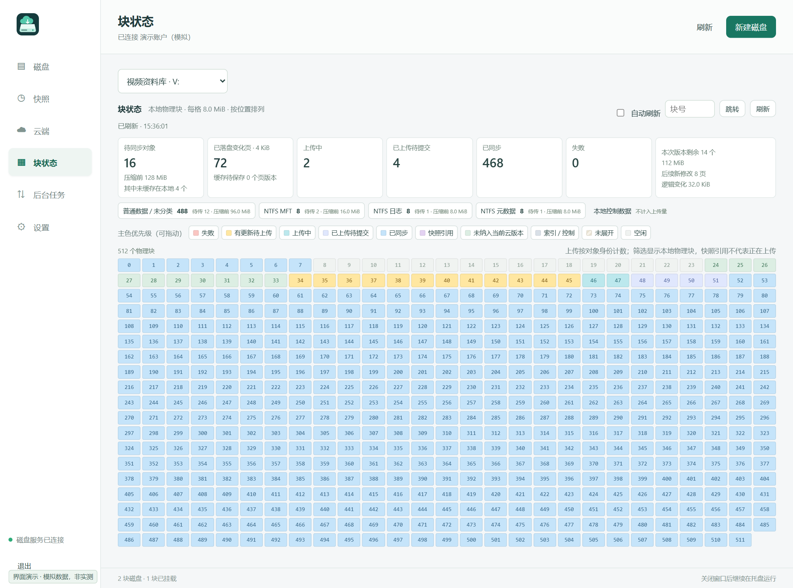
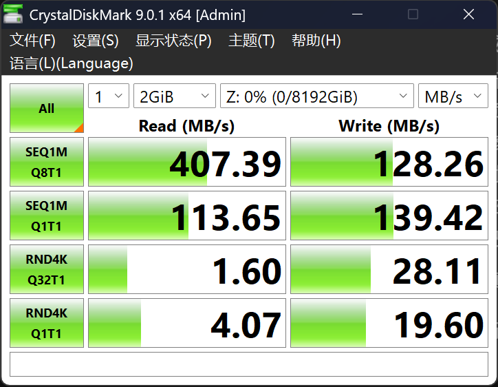

# NetDiskDrive

**把百度网盘变成一块按需读取、增量同步的 NTFS 加密硬盘。**

加密视频直接用播放器打开，大文件只改一小部分就同步变化页，数 TB 的虚拟盘只在本地保留常用内容。应用看到的是普通 Windows 盘符；加密、缓存、快照和云端同步由 NetDiskDrive 处理。

[下载 Windows 版](https://github.com/sydxsty/NetDiskDrive/releases/tag/v0.8.0) · [使用指南](docs/USER-GUIDE.zh-CN.md) · [界面演示](docs/DEMO.zh-CN.md) · [测试与配置](docs/BENCHMARK.zh-CN.md) · [反馈问题](https://github.com/sydxsty/NetDiskDrive/issues)

**v0.8.0 开发预览**：云端副本的索引与内容均按需加载；卸载后可手动加载云端最新快照，复用已有缓存。本版还修复 GPT 云端恢复请求过大，并将网盘请求监控与同步诊断集中到“后台任务”。

> **开发阶段 · 使用风险自担。** 当前为预发布版本，存储格式和网盘接口仍可能变化，可能出现数据丢失、同步失败或无法挂载。请先用可丢弃数据体验，重要文件保留独立备份；本软件不提供任何担保，也不是百度官方产品。

## 特别之处

NetDiskDrive 将**真正的块设备、页级增量、透明加密与云端按需缓存**放在同一条数据路径上，面向“像本地盘一样使用云上的加密大文件”。

| 你想做的事 | NetDiskDrive 的做法 |
| --- | --- |
| **云上加密视频，点开就播** | 普通播放器访问盘符，缺少的对象按需下载、解密，并预取后续内容；不用先下载并解密整个视频。首次读取和跳转仍受网络速度影响。 |
| **大文件小修改，只同步变化** | 写入时跟踪 **4 KiB 页**，不同位置的修改合并到同一对象；未改的数据继续复用。传输还包括必要索引和 NTFS 元数据。 |
| **几百 GB 的 SSD，使用数 TB 的虚拟盘** | 单一稀疏容器配合本地缓存软上限，只淘汰已有可靠云端副本的对象，未同步修改始终保留。 |
| **旧版本可以回来** | CoW 整盘快照固定一个版本，恢复为新盘提取文件；同步时也固定版本，期间的新写入进入下一轮。 |
| **知道后台到底做了什么** | 紧凑块状态页区分待上传、上传中、已同步、内容类型和引用；日志记录对象上传、复用、下载及版本提交。 |

Windows 使用原生 NTFS 处理文件、目录与应用读写；云端保存的是压缩对象和版本描述，不会生成可在百度网盘网页里直接浏览的原始文件目录。



*界面图片使用演示数据，不代表实际账户、流量或性能。更多页面见[演示画廊](docs/DEMO.zh-CN.md)。*

## 五分钟开始使用

### 1. 安装运行依赖

支持 **Windows x64**。需要：

- [.NET 8 Desktop Runtime](https://dotnet.microsoft.com/en-us/download/dotnet/8.0)（x64，选择 **Desktop Runtime**）。
- [Microsoft Edge WebView2 Runtime](https://developer.microsoft.com/en-us/microsoft-edge/webview2/)（许多 Windows 电脑已安装）。
- [Visual C++ Redistributable x64](https://aka.ms/vs/17/release/vc_redist.x64.exe)。
- **WinSpd 驱动**：发布包附带固定版本的官方签名安装器，可通过程序安装。安装驱动、创建及挂载磁盘会请求管理员权限。

从 [Releases](https://github.com/sydxsty/NetDiskDrive/releases/tag/v0.8.0) 下载 `NetDiskDrive-v0.8.0-windows-x64.zip`，完整解压，运行 **`OverlayDisk.exe`**。这是当前程序文件名。升级时先退出旧版托盘程序，再将新版解压到独立目录；请保留整个目录，不要只复制 EXE。主界面按普通权限启动，磁盘服务按需提权。

### 2. 创建并使用磁盘

1. 点击“新建磁盘”，选择容器位置、虚拟容量、盘符和 **4 / 8 / 16 MiB** 对象大小；对象大小创建后固定。
2. 需要保护内容时启用加密并妥善保管密码，密码丢失无法恢复。程序自动建立数据分区、格式化 NTFS（4 KiB 簇）并分配盘符。
3. 在资源管理器里像普通硬盘一样复制、编辑文件或打开视频。支持**只读 / 读写挂载**；切换模式先安全卸载。容量上限为 **8 TiB**，不预先占用等量物理空间。

### 3. 登录百度网盘并同步

1. 进入“云端”→“登录百度网盘”，在内置 WebView2 中完成官方网页扫码或验证。会话由当前 Windows 用户保护保存；加密盘密码不保存。
2. 为磁盘启用同步，可设置本地缓存上限。首次上传全部必要对象，之后按变化同步。
3. 点击“立即同步”，在任务日志查看上传的对象及提交结果。**文件已保存 ≠ 云端版本已提交**，以界面的“云端已同步”为准。
4. 在设置中调整同步、全局请求限额和预取。默认自动同步间隔 3600 秒、同时传输 4 个对象；每秒最多 3 个网盘请求、最多 4 个同时请求，所有磁盘共享请求额度。在“后台任务”查看正在进行和排队的请求，以及各磁盘的同步诊断。

关闭窗口会收起到托盘，后台继续工作；从托盘退出会保存并安全卸载磁盘。“退出前同步”默认关闭，未同步修改将留在本地；可在设置中启用。新默认值用于新配置或缺失字段，已经保存的设置按保存值加载。

### 4. 从云端导入

“云端”选择磁盘后导入，只先验证版本记录、根对象和必要的初始索引。其余索引和文件内容在访问时下载，不先展开全盘页映射。**只读和读写挂载共用这一加载路径**；挂载本身也可能读取分区表和 NTFS 所需对象。界面显示已加载内容的验证范围，未访问部分不视作已经完整校验。

- **新建副本（默认）**：适合另一台电脑使用，创建新的磁盘身份，**默认关闭云同步**。本地修改只保存在本地；以后手动启用同步时才使用自己的云端目录，首次发布需要复制基础对象，可能产生额外下载、上传和空间占用。
- **恢复原硬盘**：适合原本地容器已删除，且确认没有其他副本或并发写者的情况，继续使用原身份、云目录与同步基线。

导入后可手动点击“加载云端最新快照”，**必须先安全卸载**，不会在挂载期间替换快照。程序只在点击时检查来源版本；存在本地修改时，需要明确确认丢弃，即使此前读写挂载后已改为只读。更新复用没有变化的缓存对象，未访问的新内容继续按需下载。此操作不会开启云同步，也不上传本地修改。

**同一块云端磁盘只允许一个写者。** 多设备不要同时写同一身份；只读看视频时优先使用只读挂载。未缓存内容需要联网，也需要源云端版本继续存在。

## 设计取舍：少请求、少重传，接受部分随机读取开销

百度网盘是远端对象存储，接口调用和网络等待的代价很高。NetDiskDrive 优先压低**请求数量、重复传输和写放大**，同时用追加写入、本地缓存和有界预取保留顺序访问能力。目标是减少接口压力和触发风控的机会，**不能保证不触发限流或账号风控**。


| 选择 | 换来的收益 | 付出的代价 |
| --- | --- | --- |
| 多个逻辑页打包为较大对象 | 降低远端文件数量、目录操作和小请求开销；合并零碎修改 | 冷缓存下读少量数据也可能下载整个对象，较大对象增加随机读取和缓存放大 |
| CoW 与不可变对象，接受碎片 | 小修改追加新页，复用未改对象；物理搬迁不改变对象身份、不重新上传 | 逻辑相邻页未必物理相邻，随机访问与空间利用率会受影响 |
| 持久变化集合、上传回执与目录缓存 | 无变化且缓存有效时零对象载荷读取、零网盘请求；避免每轮全量检查目录 | 依赖单写者约束；不要在网页端手动改删内部对象 |
| 有界预取与全局限流 | 连续视频读取提前准备后续对象，限制所有磁盘的请求压力 | 跳转可能等待，未使用的预取也可能消耗流量；可关闭或降低预取 |
| TRIM、整理、旧云对象删除全部手动 | 避免后台维护突然制造额外工作和网盘调用 | 空洞、旧版本与仍被引用的对象会继续占用空间 |

**怎么选对象大小？** 优先考虑随机访问和较小缓存时选 4 MiB；以连续视频或大文件为主时可选 8 / 16 MiB，接受更大的冷读粒度。具体效果取决于工作负载与网络，较大的对象并不保证更快。

普通整理只回收无引用空间，不搬运存活对象；深度压紧只搬迁完整对象，保持对象 UUID、摘要和上传回执。两者均不为追求物理连续而重新打包存活页。设置缓存上限后，已同步对象的自动缓存淘汰是另一项独立机制。

## 加密与压缩

- **内容加密：XChaCha20-Poly1305**，256 位卷密钥、24 字节 nonce，保护数据页和内部索引等元数据，并验证认证标签。
- **密码派生：Argon2id v1.3**，64 MiB 内存、3 轮、1 lane、独立随机 salt；派生密钥用于封装新建卷的随机卷密钥。密码不直接作为数据密钥。
- **完整性：**下载时检查压缩封装、大小与 SHA-256，读取加密页时再验证 AEAD。上传以网盘成功回执确认，不为每个已上传对象重复下载回验。
- **传输压缩：zstd level 3**。对已封口对象压缩；加密盘是**先加密页面，再压缩对象**，主要减少未填满对象的零尾部，不保证密文数据本身可压缩。

盘名、UUID、容量、对象数量和版本等管理信息仍可见。解锁挂载后，具有读取权限的本地程序可以访问明文；本项目没有独立安全审计，也不提供防录屏、防复制或整卷防回滚保证。快照包含 NTFS 日志，提供文件系统崩溃一致性，不等同于 VSS 应用一致性备份。

## CrystalDiskMark 示例

用户提供的**加密盘本地挂载测试**：三星 970 EVO PLUS 512 GB、Intel Core i9-10900KF、8 MiB 对象。CrystalDiskMark 9.0.1 x64，1 次，2 GiB 测试文件，Z: 8 TiB 虚拟容量。



| 项目 | 读取 MB/s | 写入 MB/s |
| --- | ---: | ---: |
| SEQ1M Q8T1 | 407.39 | 128.26 |
| SEQ1M Q1T1 | 113.65 | 139.42 |
| RND4K Q32T1 | 1.60 | 28.11 |
| RND4K Q1T1 | 4.07 | 19.60 |

这是单次示例，**不代表云端上传、冷读下载速度或所有机器的性能**。内存、系统版本及缓存状态未提供；云同步开关未作为该次测试变量记录，也没有据此证明它对性能无影响。截图不能单独量化上述设计取舍的性能收益。[完整配置与边界](docs/BENCHMARK.zh-CN.md)

## 从源码构建

需要 Rust stable（x64 MSVC）、Visual C++ Build Tools 和 .NET 8 SDK。在 Windows 的开发者 PowerShell 中：

```powershell
git clone https://github.com/sydxsty/NetDiskDrive.git
cd NetDiskDrive
powershell -ExecutionPolicy Bypass -File scripts/build.ps1
```

构建脚本准备固定版本 WinSpd、运行功能测试并输出 `artifacts/OverlayDisk-v0.8.0/`；下载及提取驱动文件不会安装内核驱动。更多步骤见[构建说明](docs/BUILD.zh-CN.md)。

源码结构：`engine/` 为 Rust 存储核心，`app/` 为 .NET 8 / WebView2 GUI 和磁盘服务，`cloud/` 提供独立后端接口、同步协调器和百度实现。当前只实现百度网盘后端，可扩展其他提供商。

v0.8.0 的[功能验证](docs/VALIDATION.md)包括按需索引与快照更新、隔离 NTFS 副本挂载、4 TiB 虚拟容量 GPT 恢复，以及新默认设置和后台任务界面。文档另行保留 v0.7.0 的原始验收记录。功能测试与上方用户 CDM 示例分别记录；隔离的云协议模拟不能视作真实账号兼容性保证。

## 使用边界与反馈

- 当前不读取或迁移旧容器、旧云格式。升级前保留原程序及数据，先阅读版本说明。
- 本地缓存上限是软上限，未同步数据、必要索引和正在读取的对象可能使占用暂时超限。
- 百度连接使用官方网页登录会话和私有网页接口，接口变化、限流或登录过期可能中断同步。没有官方合作、接口稳定性或可用性承诺。
- 本项目尚处开发阶段。报告问题请提供版本、对象大小、是否加密和脱敏后的错误信息；**不要上传密码、Cookie、完整容器或私人文件**。

欢迎通过 [Issues](https://github.com/sydxsty/NetDiskDrive/issues) 和 Pull Requests 反馈与贡献。涉及数据完整性的修改请附隔离容器测试；涉及网盘请求的修改请说明是否增加远端调用。

## 许可证与致谢

整体应用按 [GPL-3.0-only](LICENSE) 开源；Rust `engine/` 自有代码保留 [MIT](engine/LICENSE)，第三方组件按各自许可证提供，见 [NOTICE](NOTICE.md) 和[第三方说明](docs/THIRD-PARTY.md)。

**WinSpd - Windows Storage Proxy Driver, Copyright (C) Bill Zissimopoulos** — [winfsp/winspd](https://github.com/winfsp/winspd)。WebView2、RustCrypto 和 ZstdSharp 等组件的版权与许可随源码和发布包保留。
