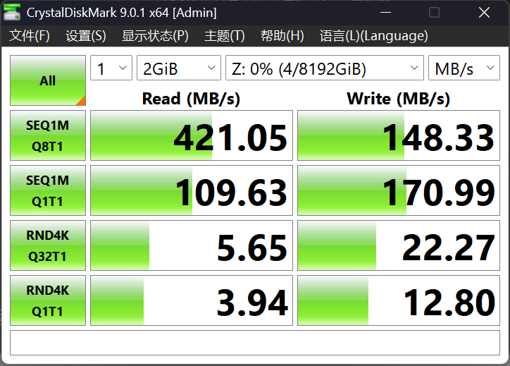

# CrystalDiskMark：用户提供的本地挂载测试

以下主要结果来自用户于 2026-10-09 提供的最新截图。维护者没有另跑吞吐基准；功能测试记录见 [VALIDATION.md](VALIDATION.md)。旧版加密盘测试保留在本文后部。

## 配置来源

| 项目 | 配置 | 来源 |
| --- | --- | --- |
| 物理 SSD | 此前提供：三星 970 EVO PLUS 512 GB | 用户此前描述；本次未重新核验 |
| CPU | 此前提供：Intel Core i9-10900KF | 用户此前描述；本次未重新核验 |
| 内存 / Windows 版本 | 未提供 | 不作推断 |
| 对象大小 | 此前提供：8 MiB（用户称 8 MB chunk） | 用户此前描述；本次截图不显示 |
| 本地 / 云端加密 | 当前源码本地明文，云端可选加密；本次云端配置未提供 | 代码设计与截图测试配置分别记录 |
| 测试软件 | CrystalDiskMark 9.0.1 x64，管理员运行 | 截图 |
| 次数 / 测试文件 | 1 次 / 2 GiB | 截图 |
| 目标盘 | Z:，显示 0%（4 / 8192 GiB） | 最新截图 |
| 显示单位 | MB/s | 截图；与 MiB/s 不混用 |
| 软件精确提交 / 测试时间 | 截图于 2026-10-09 提供；运行提交和测试开始时间未独立核验 | 在 `208fb84` 修复构建交付后提供，不据此认定精确运行提交 |
| 缓存冷热 / 文件系统缓存 / SSD 固件 | 未提供 | 不作推断 |
| 云同步开关及并发负载 | 本次未提供 | 未测量其影响 |

## 截图数值

| 项目 | 读取 MB/s | 写入 MB/s |
| --- | ---: | ---: |
| SEQ1M Q8T1 | 421.05 | 148.33 |
| SEQ1M Q1T1 | 109.63 | 170.99 |
| RND4K Q32T1 | 5.65 | 22.27 |
| RND4K Q1T1 | 3.94 | 12.80 |

这是本地挂载路径的单次示例，不是百度网盘上传速度、首次冷读下载速度或多轮统计。2 GiB 测试会受到缓存、队列深度、存储布局、SSD 状态和背景工作影响，不能由截图推断所有工作负载的性能，也不能单独证明某一设计带来的收益。

## 历史结果：旧版本地加密盘

用户此前提供的配置为三星 970 EVO PLUS 512 GB、Intel Core i9-10900KF、8 MiB 对象、本地加密开启。截图同为 CrystalDiskMark 9.0.1 x64，1 次、2 GiB、Z: 8 TiB；精确提交、内存、系统和缓存状态未记录。

| 项目 | 读取 MB/s | 写入 MB/s |
| --- | ---: | ---: |
| SEQ1M Q8T1 | 407.39 | 128.26 |
| SEQ1M Q1T1 | 113.65 | 139.42 |
| RND4K Q32T1 | 1.60 | 28.11 |
| RND4K Q1T1 | 4.07 | 19.60 |

两次结果的本地加密布局、缓存状态等条件未统一核验，因此不报告优化提升比例，也不将最新结果归属于已有的 v0.8.0 Release。

当前设计愿意接受碎片与部分随机读放大，以减少网盘对象操作、全量扫描、重复上传和物理重写；相关取舍见 [README](../README.md#设计取舍少请求少重传接受部分随机读取开销)。

如自行复测，请仅使用可丢弃的新测试盘，并一起记录内存、系统版本、软件提交、对象大小、加密与缓存状态、同步/预取设置、并发任务、测试次数和文件大小。不要把测试盘设为重要文件的唯一副本。

WinSpd - Windows Storage Proxy Driver, Copyright (C) Bill Zissimopoulos — https://github.com/winfsp/winspd
