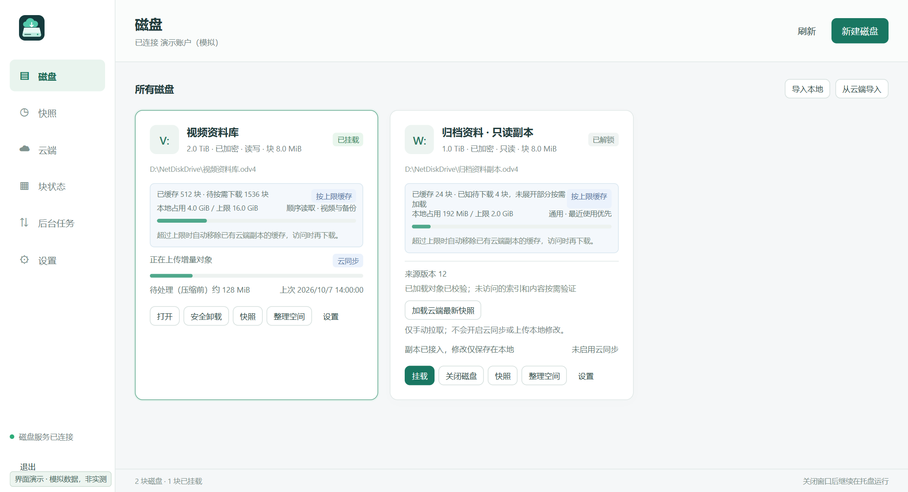
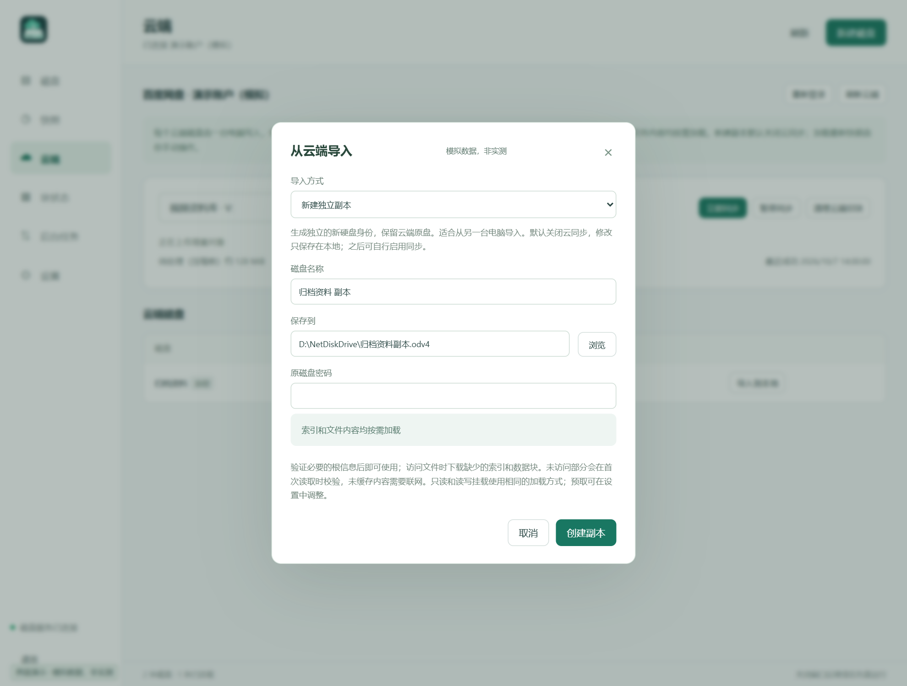
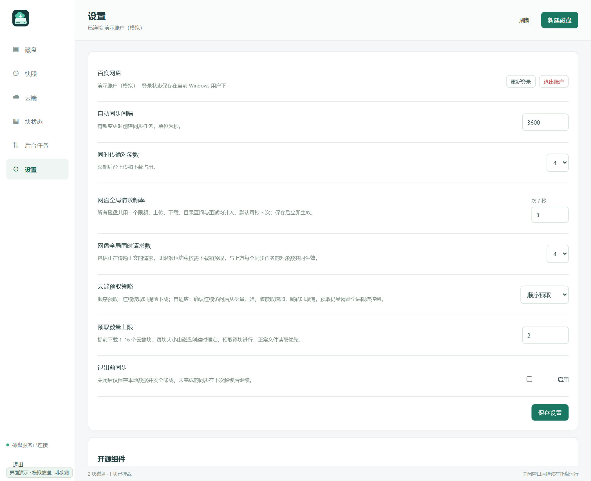
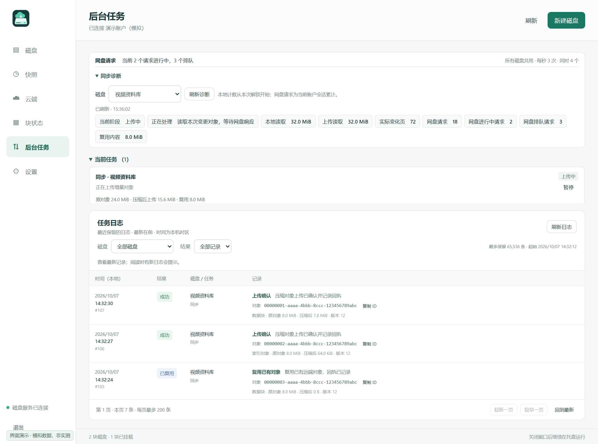

# NetDiskDrive 界面演示

以下截图使用 **0.8.0 预发布源码的实际 Web UI**，由隔离的模拟宿主提供示例数据。账户、盘符、路径、容量、块状态、日志和传输字节数均为演示数据；未连接真实云账户，也未操作真实磁盘。它们不代表实测云流量、压缩率或性能，不包含 CrystalDiskMark 测试结果。

每张图均带“模拟数据，非实测”标记；点击图片可查看原图。程序文件名仍为 `OverlayDisk.exe`。

## 磁盘与本地缓存

查看盘符、加密和挂载状态，直接打开或安全卸载磁盘。启用缓存上限后，界面区分本地占用与虚拟容量；索引尚未全部展开时，只显示已知的待下载数量。导入副本默认不启用云同步，可在卸载后手动加载云端最新快照；有本地修改时需要确认丢弃。

## 块状态

按本地物理位置查看对象状态，并按状态或内容类型筛选。待同步总数包含尚未缓存在本地的对象；物理网格只显示本地块。拖动图例调整颜色优先级，不改变块号顺序。

## 从云端导入

默认创建独立副本并关闭云同步：先验证根信息和必要的初始索引，其他索引与文件内容在访问时下载，不再提供完整下载开关。只读与读写挂载共用这一加载方式，未访问部分不视作已经完整校验。恢复原硬盘身份是另一项明确选择，要求确认没有其他本地副本或并发写入者。

## 请求限制与预取

设置同步间隔、同时传输对象数、全局请求限额，以及顺序或自适应预取。新配置默认为每 3600 秒自动同步、4 个传输对象、每秒 3 个网盘请求、同时 4 个请求，退出前同步默认关闭；已有个人设置保留。设置页只调整配置，实时请求监控位于后台任务页。

对象大小在创建磁盘时选择 4、8 或 16 MiB，预取数量按该磁盘的对象大小计算。

## 后台任务、请求监控与诊断

页面顶部显示所有磁盘共用的请求进行中与排队数量。展开同步诊断后选择磁盘，查看当前阶段、本地读写量和请求计数；收起或离开页面后停止读取诊断。这些更新不会重置下方日志的页码或滚动位置，也不依赖块状态页的自动刷新开关。

日志逐条展示上传确认、对象复用和版本准备记录，分别显示原对象大小与压缩后上传字节数，支持筛选磁盘、只看错误和复制对象 ID。下图数值仅用于说明字段含义，不能据此推算实际压缩收益。

WinSpd - Windows Storage Proxy Driver, Copyright (C) Bill Zissimopoulos — https://github.com/winfsp/winspd
